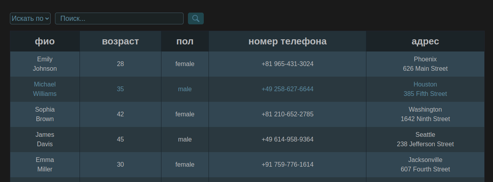

# Таблица с данными

[ссылка на деплой](https://foxy-desu.github.io/table/)

Приложение реализует запрос данных о пользователях с ресурса [DummyJson](https://dummyjson.com/users) c возможностью фильтрации.

Для фильтрации запрашиваемых с сервера данных необходимо выбрать критерий, ввести запрос, кликнуть на кнопку поиска.

Запрос на получение фильтрованных данных будет успешен в том случае, если по выбранному критерию найдены точные соответствия поисковому запросу.
